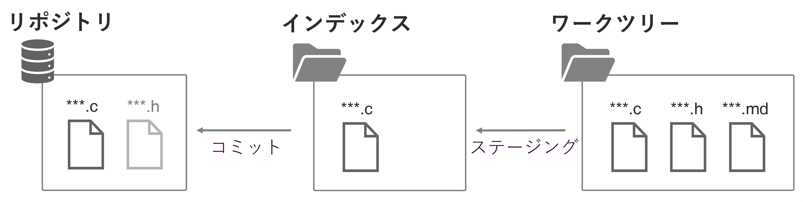
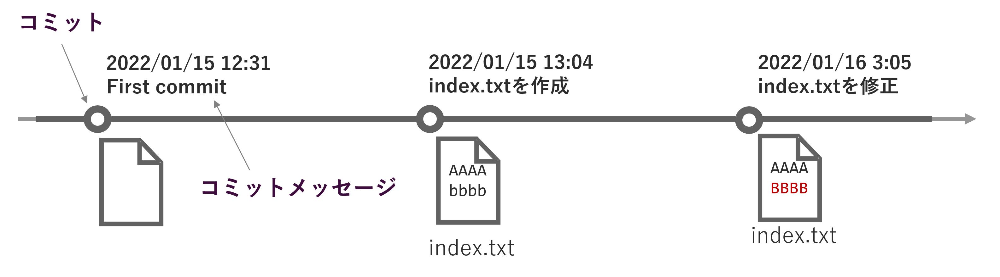
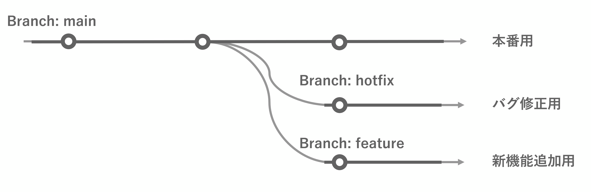
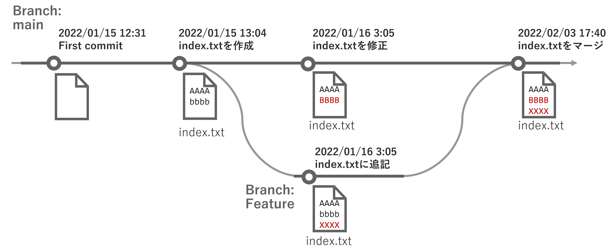
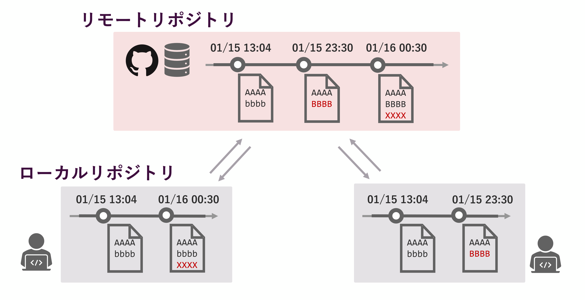
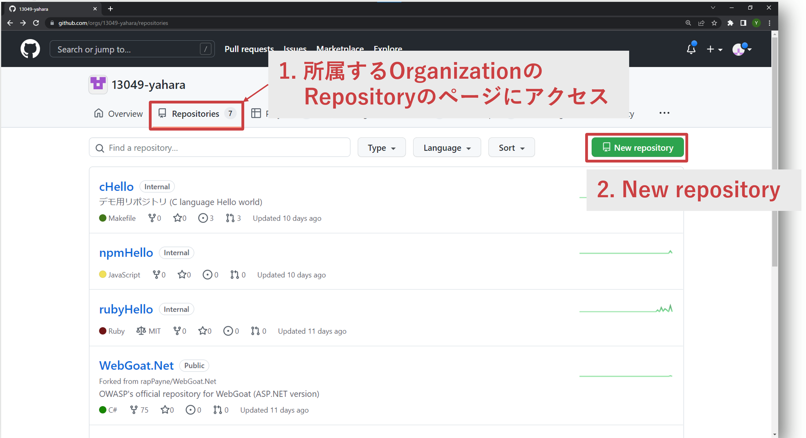
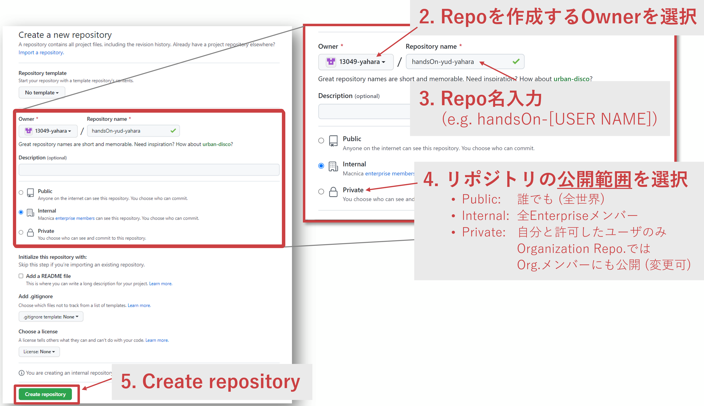
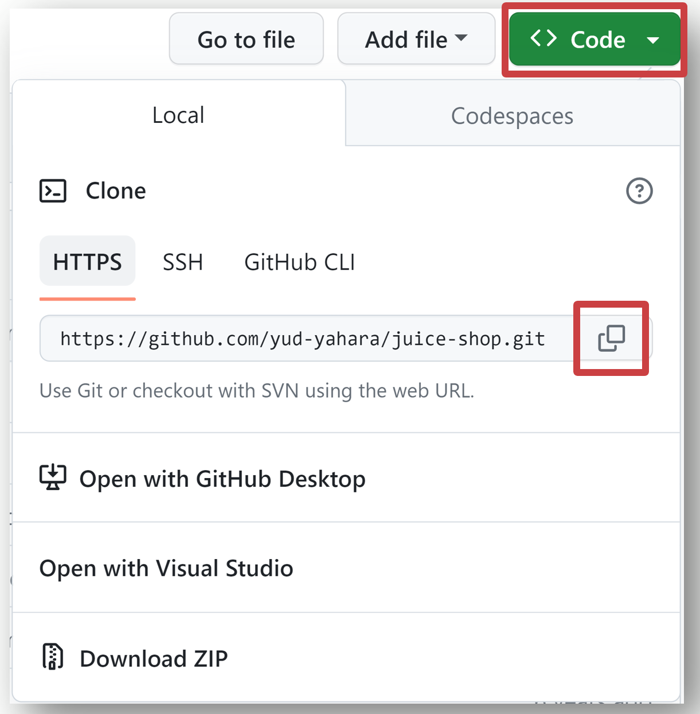

# Gitに触れながら理解を深める

## はじめに

本資料では、Gitの入門編として、コマンドラインベースでGitを用いたバージョン管理を行う方法、手順を説明する。本資料の内容を実施することで、ローカル/リモートリポジトリの作成やファイルのコミット、プッシュ、ブランチの作成等が可能となる。

## 目次

- [リポジトリの作成](#repo)
- [ファイルのステージング](#add)
- [コミット](#commit)
- [ブランチを切る](#branch)
- [ブランチをマージする](#merge)
- [リモートリポジトリへ変更を反映](#push) 
- [複数人での作業](#team)


## Gitで作業するための準備: git config

はじめに、Git操作のための初期設定 (ユーザ名、メールアドレスの登録) をする。
以下コマンドをターミナル (Git Bash、コマンドプロンプト、iTerm等) 上で以下を入力

```bash
$ git config --global user.name "USERNAME (e.g. yud-yahara)"
$ git config --global user.email "EMAIL ADDRESS (e.g. macnica-a@macnica.co.jp)"

$ git config --list
```

## ここからはローカルリポジトリで作業する


<a id="repo"></a>
## リポジトリの作成: git init

- リポジトリ: ファイルやディレクトリの状態・変更履歴を記録する場所
    - プロジェクトごと、アプリケーションごとに作成する

### 空のリポジトリを作成する

```bash
$ cd  # (Git Bashでコマンドを入力する場合、最初ルートディレクトリに多いため、適宜別ディレクトリへ移動する)
$ mkdir gitPrac
$ cd gitPrac
$ git init

$ ls –a
```

`git init` を実行すると、.gitという名前のディレクトリが作成される。このディレクトリ内に作業ログ、変更履歴、その他設定情報が記録される

<a id="add"></a>

## ステージング: git add



- ワークツリー: 実際に作業をしているディレクトリのこと
- インデックス: リポジトリに作業を記録する (コミットする) 準備するための場所

### 1. ファイルを作成・編集

```bash
$ vim helloworld.txt  # (好みのエディタで編集)
```

### 2. Gitでの作業追跡状況を確認

```bash
$ git status
```


### 3. 作成したファイルをステージング

```bash
$ git add FILENAME
$ git status
```

<a id="commit"></a>

## コミット: git commit

- コミット: ファイルやディレクトリの追加・変更をリポジトリに記録する操作
    - バグ修正や機能追加ごとにコミットを行う
    - 異なる機能実装時にはコミットを分ける
    - 後から履歴を見て特定の変更内容を探しやすいようにする



### 1. ステージングしたファイルをコミットする

```bash
$ git commit -m "COMMIT MESSAGE"
```

コミットメッセージには、「何をしたか」を記録する

- Bad ex.: “edit helloworld.c”
- Good ex.: “revise hoge bugs”, “fuga機能をhoge部に実装”

その他、コミットした日時、人 (ユーザ名) については自動的に記録される。

### 2. 作業履歴を確認

```bash
$ git log
```


<a id="branch"></a>

## ブランチの作成・移動: git branch, git checkout

ブランチ: 履歴の流れを分岐して記録するためのもの

- 分岐したブランチは、他のブランチの作業の影響を受けない



### 1. ブランチを作成

```bash
$ git branch # 現在のブランチを確認
$ git branch BRANCHNAME
$ git branch
```

### 2. 別ブランチへ移動

```bash
$ git checkout BRANCHNAME
$ git branch
```

### 上記1, 2のブランチ作成・移動を一括で行うには

```bash
$ git checkout -b BRANCHNAME
```

### 3. 移動先のブランチで作業

```bash
$ vim FILENAME
$ git add FILENAME
$ git commit -m "COMMIT MESSAGE"
$ git log
```


<a id="merge"></a>

## マージ: git merge

マージ: 作業が完了したブランチを別のブランチに取り込むこと



### 1. 上記で作成したブランチを別ブランチにマージする

```bash
$ git checkout BASE-BRANCH # マージ先のブランチへ移動
$ git merge COMPARE-BRANCH # マージ元のブランチを指定

$ git log
$ git graph
```

マージ時に各ブランチの作業で同じ行を修正していた場合、コンフリクト（競合）が発生し、マージできなくなる。コンフリクトが発生した際には、手動でコンフリクトを修正し、マージする必要がある。

## ここからは、ローカルリポジトリとリモートリポジトリの両方で作業する



## GitHub上にリポジトリを作成

[新しいリポジトリの作成 - GitHub Docs](https://docs.github.com/ja/repositories/creating-and-managing-repositories/creating-a-new-repository)






<a id="push"></a>

## リモートリポジトリにローカルリポジトリの変更内容を反映: git push

### 1. ローカルリポジトリにリモートリポジトリを追加

```bash
$ git remote -v
$ git remote add origin URL # URLはGitHubのリポジトリのURLを記載 (以下画像参照）
$ git remote -v
```



### 2. リモートリポジトリにローカルリポジトリの変更をPushする

```bash
$ git push -u origin BRANCHNAME # -uオプションを付けると、それ以降同じブランチでのPush時にはorigin/BRANCHNAMEの記載が不要となる
# 初めてGitHubにPushする場合、ユーザ名の入力やGitHubの認証が求められる場合がある
```

### 3. GitHub上で変更の反映を確認

### (参考) GitHub上でもファイルの操作、Git操作は可能

[ファイルをリポジトリに追加する - GitHub Docs](https://docs.github.com/ja/repositories/working-with-files/managing-files/adding-a-file-to-a-repository)

[リポジトリ内でブランチを作成および削除する - GitHub Docs](https://docs.github.com/ja/pull-requests/collaborating-with-pull-requests/proposing-changes-to-your-work-with-pull-requests/creating-and-deleting-branches-within-your-repository)

## 他の人のリポジトリも触ってみる（複数人での作業）

リポジトリOwnerの許可を得てから実施すること。

### 1. 既存リポジトリをローカルにクローンする

```bash
$ cd # ここまで作業を行っていたディレクトリとは別のディレクトリへ移動する
$ git clone URL
$ ls
$ cd REPONAME
```

### 2. add → commit → push

```bash
$ vim NEWFILE
$ git add NEWFILE
$ git commit -m "COMMIT MESSAGE"

$ git log

$ git push origin BRANCHNAME
```

<a id="team"></a>

## リモートリポジトリの内容をローカルリポジトリに反映させる （他の人が行った作業をローカルに反映させる）: git pull, git fetch, git merge

```bash
$ git fetch origin BRANCHNAME # リモートリポジトリから最新情報をローカルに持ってくる
$ git merge origin/BRANCHNAME
```

`git fetch` の時点では、ローカルにある、リモート追跡ブランチ (origin/main 等) へリモートの最新情報が反映され、ローカルのブランチ (main 等) へはリモートのコミットは反映されていない。

 そのため、`git merge`を用いてローカルのブランチへ反映が必要。

- `git fetch` : リモートリポジトリ上の「main」ブランチ → ローカルリポジトリ上の「origin/main」ブランチ（リモート追跡ブランチ）
- `git merge` : ローカルリポジトリ上の「origin/main」ブランチ → ローカルリポジトリ上の「main」ブランチ

上記2つのコマンドを同時に実行するコマンド

```bash
$ git pull origin BRANCHNAME
```

## 発展編

実際にGitを触っていると以下のことをしたい場合がある。どうやってやるかを調べてみよう。

- 一時的に1つ前のバージョンにしたい
- 直前のcommitを取り消したい
- 5個前のcommitまで戻って、それ以降を削除したい
- GitHubにpush したcommitを消したい
- `git add . `を実行すると、ディレクトリ内のファイルを一括でステージングできる。では、そのときにトラッキングする必要がないファイルが存在する場合はどうすればよい？

## Reference

- [サル先生のGit入門](https://backlog.com/ja/git-tutorial/)
    - [Git逆引き入門 - サル先生のGit入門](https://backlog.com/ja/git-tutorial/reference/)
- [Git公式ドキュメント](https://git-scm.com/docs)
- [Gitチートシート](https://training.github.com/)
- [いまさらだけどGitを基本から分かりやすくまとめてみた - Qiita](https://qiita.com/gold-kou/items/7f6a3b46e2781b0dd4a0)


以上
